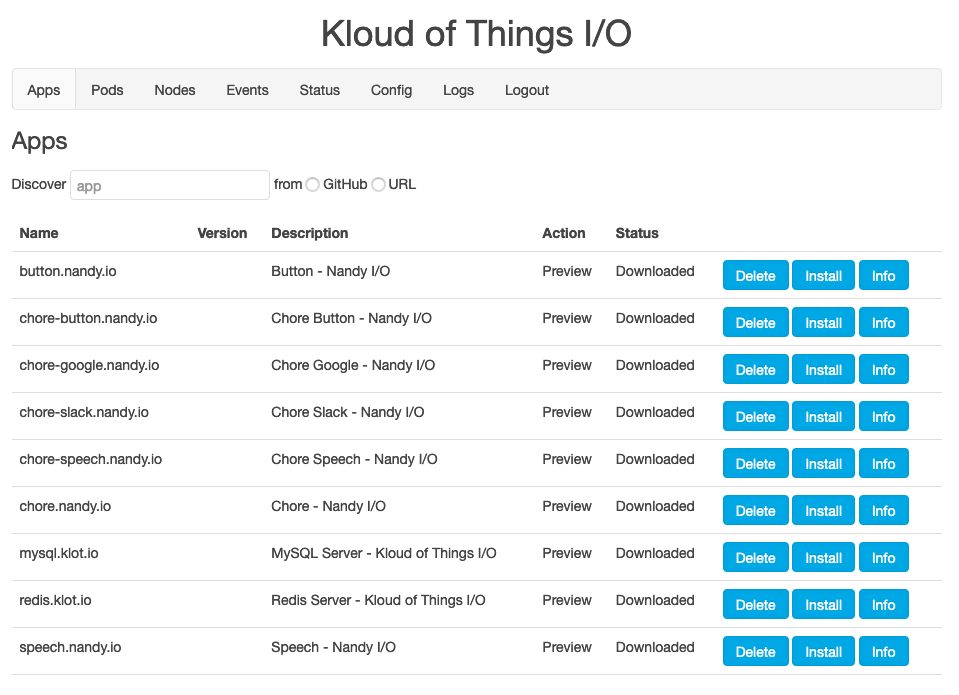
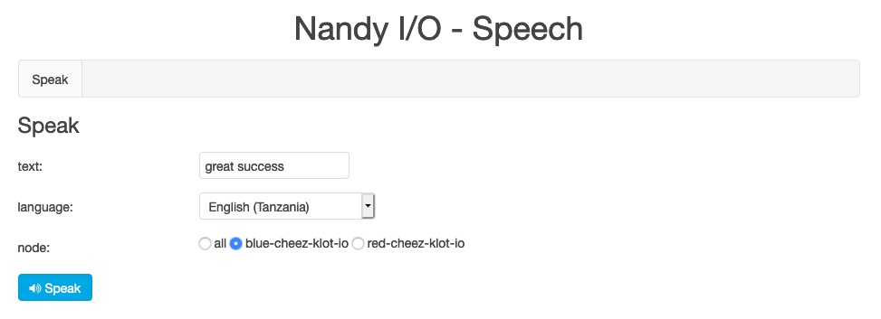

# Apps! Apps! Apps!

Make sure you have a Master node and a Worker or two before installing Apps. Head back to [Install](Install.md) for how. Else hit up the Apps page on your Master.

In the future, I'll have a bunch of Apps. For now there's just Nandy Speech and Redis (well there's a ton more I just haven't writtend docs for them). Nandy Speech allows you hook up some speakers to your Pi and make it say stuff, even in various accents. It'll be used by the forthcoming Nandy Chore to yell at you or your kids to do stuff. Redis is a general Redis server which can be used by other Apps, like Nandy Speech in this case.

## Download

- Go to the Apps page in the GUI.
- Enter 'speech.nandy.io' in the app field.
- Select GitHub for the from field
- Enter 'nandy-io/speech' in owner/project field.
- Leave the following two fields blank (defaults of master and klot-io-app.yaml)
- Click the Download button.
- In 10-20 seconds, Nandy Speech and Redis will appear in the Apps listing, prepping to be installed.

### Labels

Some Apps require that you label nodes. In some cases, it's so the App knows which Nodes have special equipment attached, like speakers for Nandy Speech. In other cases, it's just for consistency.  So if a part of the App suddenly dies, it'll come back on the same Node, like with Redis. The App's page allows you to set these labels easily with checkboxes.

- Click the Redis App.
- Click a checkbox under labels to place it on a specfic Node (required).
- It will be automatically saved.
  - You can uncheck a checkbox to remvoe a label.

- Go back to Apps.
- Click the Nandy App.
- Click a checkbox under labels to tell it which Nodes have speakers attached
  - You can connect headphones to the node you selected for now

For you Kubernetes savy folks, yes this is labeling Nodes through traditional Kubernetes. It'll prefix the actual labels with the app name. So `storage` is really `redis.klot.io/storage` and 'speakers' is really `speech.nandy.io/speakers`.

## Install

- After labelling, click Install
- Head over to the Pods page to watch the Pods come up (Status = Running).
  - Click the speech-nandy-io namespace to focus on the Pods we care about
- Once they're all up, head back to Apps
- Click Open in the Nandy Speech App.
  - If this doen't work, wait several more minutes.
  - I need to have better visibility into what's really ready.
- Type something (preferably inappropriate) and listen to your own shenanigans.

## Great Success

Congrats! You now have Nandy Speech (and a Redis server) running in your home cluster!

Yep, that's a URL on your local network based on the App and Service name. For you Kubernetes savy folks, yes nginx serving the site on each node also acts as a distributed Ingress controller using LoadBalancer Service definitions. For anyone wondering how the hell the DNS is working, we're using that same Service to register CNAMES through avahi / mDNS.  Neat huh?

## Uzbeki Blues

If you're on Windows, the URL of the Apps might not work.  If you're on an Android tablet, accessing the Apps probably won't work at all. We're using mDNS here and it's not fully supported on Windows/Android in some cases.

Fortunately, we have a way around it, if you're down with some network settings.

- Figure out the IP of your Master node
  - You should have already locked that in setting everything up
- Go into your device's network DNS settings
- Replace the DNS servers with the IP for your Master node

NOTE: You best keep your Master node running for that device to work properly, whether you're using Klot I/O or not.

That's because the Master node of Klot I/O acts as a DNS server, serving our special mDNS records through regualr DNS, and passing everything else through to whatever the Pi is using for DNS. So while your errants devices can't use mDNS, we can fake them out a little with some mini DNS (Don't look up that term - I just made it up).

## The Legends Continue...

Here's a list of all the Apps with their current statuses:
- green - ready to go with good docs
- blue - ready to go with bad or no docs
- yellow - barely remember how it works
- red - vaporware

| name | status | description |
| ---- | ------ | ----------- |
| [redis.klot.io](https://github.com/klot-io/redis) | blue | Redis server |
| [mysql.klot.io](https://github.com/klot-io/mysql) | blue | MySQL server |
| [speech.nandy.io](https://github.com/nandy-io/speech) | blue | Text to Speech on the Pi's |
| [chore.nandy.io](https://github.com/nandy-io/chore) | blue | Chores for the kiddos (and adults) |
| [button.nandy.io](https://github.com/nandy-io/button) | blue | Responds to buttons pushed on the Pi's |
| [chore-speech.nandy.io](https://github.com/nandy-io/chore-speech) | blue | Chore to Speech integration (yells at the kiddos) |
| [chore-button.nandy.io](https://github.com/nandy-io/chore-button) | blue | Chore to Button integration (kiddos push a button to complete a task) |
| [chore-google.nandy.io](https://github.com/nandy-io/chore-google) | yellow | Chore to Google Calendar integration for scheduling |
| [chore-slack.nandy.io](https://github.com/nandy-io/chore-slack) | yellow | Chore to Slack integration for notification |
| [share.nandy.io](https://github.com/nandy-io/share) | red | Account for time and money in the household (read: allowance) |
| [chore-share.nandy.io](https://github.com/nandy-io/chore-share) | red | Chore to Share integration (reward the kiddos / game the system) |
| [graphite.klot.io](https://github.com/klot-io/graphite) | red | Graphite server |
| [chore-graphite.nandy.io](https://github.com/nandy-io/chore-graphite) | red | Chore to Graphite integration, long term metrics |
| [share-graphite.nandy.io](https://github.com/nandy-io/share-graphite) | red | Share to Graphite integration, long term metrics |
| [grafana.klot.io](https://github.com/klot-io/grafana) | red | Grafana server |
| [chore-grafana.nandy.io](https://github.com/nandy-io/chore-grafana) | red | Chore to Grafana integration, data visualization |
| [share-grafana.nandy.io](https://github.com/nandy-io/share-grafana) | red | Share to Grafana integration, data visualization |
